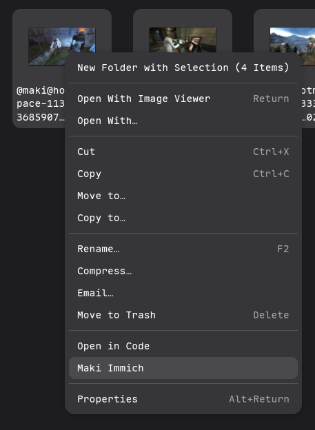
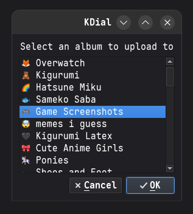
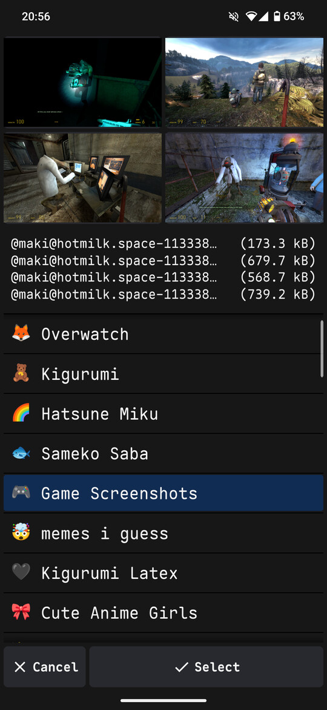

# maki immich

tiny program to upload to immich like an image board

-   select an album to upload one or more images to
-   date and time gets reset on those images
-   many go routines. it's very fast
-   gnome nautilus support to upload many
-   android support that scrapes and uploads
-   web extension that also scrapes

this program is for my own leisure. you're on your own

<table>
    <td valign="top">
        linux
          
        
        
    </td>
    <td valign="top">
        windows and android
          
        
    </td>
</table>

## how

-   add `immich.txt` to `immich/` folder 
    **line 1:** url to instance 
    **line 2:** api key

<!-- -   Add `nitter.txt` (url) to `scrape/` folder 
    Recommend using a private instance -->

-   add `mastofedi.txt` to `scrape/` folder 
    **line 1:** url to your mastodon instance 
    **line 2:** access token with `read:search` scope

| platform | scrape | upload | how                  | build                          |
| -------- | ------ | ------ | -------------------- | ------------------------------ |
| linux    |        | ✔️     | command or nautilus  | `just build install`           |
| windows  |        | ✔️     | drag images onto exe | `just build-mobile-on-desktop` |
| android  | ✔️     | ✔️     | share with app       | `just build-apkinstall-apk`    |
| firefox  | ✔️     |        | click extension      | `just build-webext`            |
